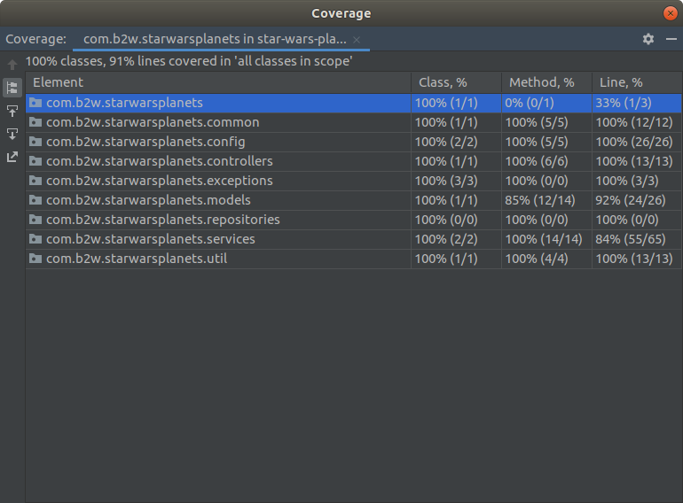

# Star Wars Planet API
API REST que contém dados dos planetas da franquia Star Wars. Cada planeta possui nome, clima, terreno e quantidade de filmes em que ele aparece, essa última infomação é recuperada da API pública do [Star Wars](https://swapi.dev/about). A API permite adicionar um planeta, listar todos os planetas, buscar planeta por nome ou por id e remover um planeta.

## Pré requisitos
- Docker
- Docker compose

## Como rodar a aplicação
1. Clone o repositório a partir do github
```sh
git clone https://github.com/schirley-jorge/star-wars-planets.git
```
2. Execute o comando abaixo para gerar uma imagem da aplicação
```sh
docker build -t star-wars-planets:local .
```
3. Inicialize a aplicação
```sh
docker-compose up -d
```
A aplicação poderá ser acessada a partir da url *http://localhost:8080/*


## Tecnologias utilizadas
- [Spring Boot](https://spring.io/projects/spring-boot)
- [MongoBD](https://docs.mongodb.com/manual/)
- [Redis](https://redis.io/documentation)
- [Swagger](https://swagger.io/tools/open-source/getting-started/)
- [Jacoco](https://www.eclemma.org/jacoco/)
- [JUnit 5](https://junit.org/junit5/docs/current/user-guide/)

## Documentação da API
Com a aplicação em execução, a especificação da API no Swagger pode ser acessada pelo [link](http://localhost:8080/swagger-ui.html). Também é possível testar a aplicação enviando requisições pelo próprio Swagger.

Exemplos de requisição:

- Para adicionar um planeta somente o campo **nome** é obrigatório
```
curl -X POST "http://localhost:8080/api/planets" -H "Content-Type: application/json" -d "{ \"climate\": \"temperate\", \"name\": \"Alderaan\", \"terrain\": \"grasslands, mountains\"}"
```

- Para listar os planetas é opcional enviar a página (*page*) e a quantidade de planetas por página (*size*), os valores *default* são *page*=0 e *size*=10
```
curl -X GET "http://localhost:8080/api/planets?page=0&size=10"
```

- Para buscar um planeta o parâmetro *searchBy* define o tipo da busca, os valores permitidos são *name* e *id*, o parâmetro *value* corresponde ao nome ou id que será buscado. A busca por nome é *case insensitive*. 
```
curl -X GET "http://localhost:8080/api/planets/search?searchBy=name&value=alderaan"
```

- Para remover um planeta é necessário enviar o id do planeta
```
curl -X DELETE "http://localhost:8080/api/planets/5ee0105d8d9996515be1f837"
```

## Abordagem
Para armazenar as informações dos planetas foi utilizado o banco NoSQL *MongoDB*. Para evitar ir a API pública todas as vezes que um planeta é recuperado, foi utlizado um mecanismo de *cache* implementado via *Redis*, sendo assim, a informação de quantidade de aparições dos planetas em filmes é armazenada na *cache* melhorando a *performance* de recuperação dessa informação, consequentemente melhora também a *performance* de recuperação das informações do planeta.

## Testes

- Excute o comando abaixo para rodar somente os testes
```sh
mvn test
```

O código possui **91%** de linhas cobertas. 

